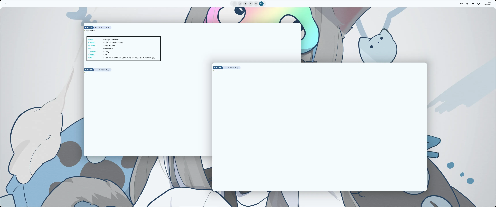
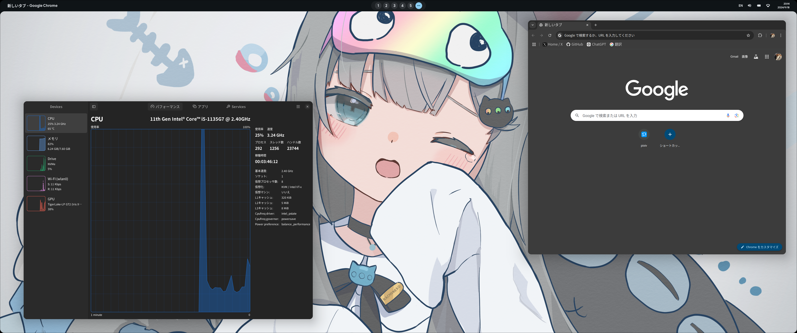

# Dotfiles
This repository manages the configuration files used with ArchLinux and Hyprland.




These dotfiles include the following settings:
* ags (Aylur's GTK Shell)
* hyprland
* neovim
* sheldon (zsh plugin manager)
* zsh

## Installation
To install, clone the repository and run `install.py`.

## Management
The list of installed packages is described in `configs/packages.toml`.
`packages.toml` has the following structure:
```toml
[package-name]
name = "package aur name"
manager = "pacman"
command = "echo hello world"
```
In `name`, specify the AUR package name.
In `manager`, specify the package manager you are using.
`command` can optionally specify a command to run after installation.

The list of dotfile installations is described in `configs/dotfiles.toml`.
`dotfiles.toml` has the following structure:
```toml
[dotfile-name]
src = "source path"
dest = "dest path"
```
In `src`, specify the path to the dotfile.
In `dest`, specify the path where the dotfile will be placed.